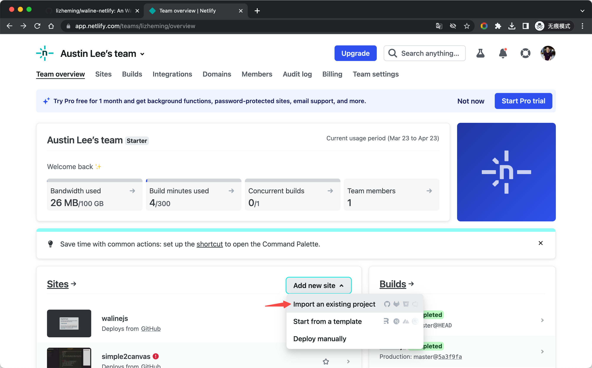
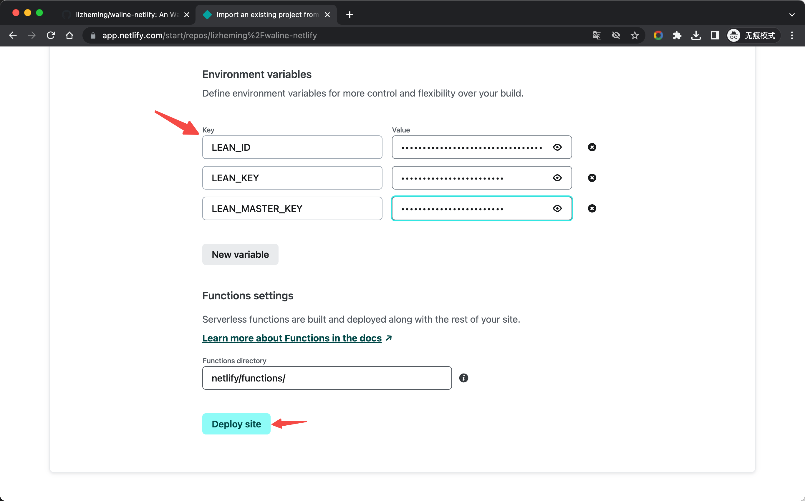
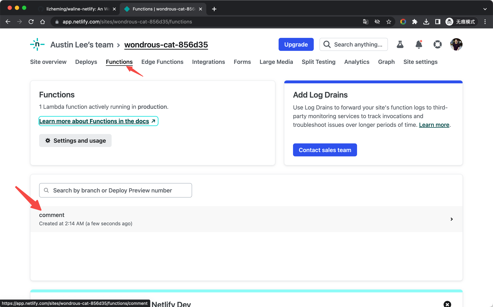
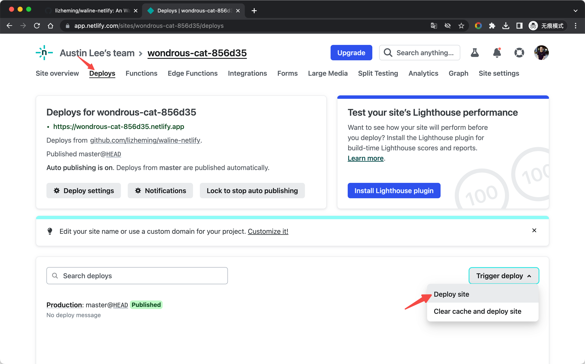

[Netlify](https://netlify.com) is a well-known static website deployment service provider, and [Edge Functions](https://www.netlify.com/blog/edge-functions-explained/) is a platform launched by Netlify A service that allows JavaScript code to be run on edge nodes of websites.

<!-- more -->

## How to deploy

Click the [Fork](https://github.com/walinejs/netlify-starter/fork) button to create a netlify startup scaffold.

<https://app.netlify.com> Log in to the Netlify console, select <kbd>Add new site</kbd> - <kbd>Import an exist project</kbd> to add the site. Select GitHub Certified to read our list of GitHub projects. Search the list for the warehouse name generated by Fork just now, and click on the project to start creating our Netlify website based on this warehouse.

|  |  |
| ----------------------------------------- | ----------------------------------------- |

Before creating a Netlify website, we need to fill in some configuration information. In addition to environment variables, we can use the default for other information. Taking the LeanCloud deployment service as an example, here we add the database service environment variables required by Waline. Click <kbd>Deploy site</kbd> at the bottom to start deploying the site.

After a while our Netlify website is successfully deployed. We can click the <kbd>Functions</kbd> navigation bar at the top to switch to the cloud function list, where `comment` is our deployed Waline service. Click it to enter the details page of the cloud function.

On the details page, the address listed in `Endpoint` is the deployment address of our Waline service. Click the copy button on the right, open it in a new tab, test the posting of comments, and everything is successful~ Next, configure this domain name in the client and you can comment happily!

|  |  |
| ----------------------------------------- | ----------------------------------------- |

## How to update

Go to the GitHub repository and modify the `@waline/vercel` version number in the package.json file to the latest version.

## How to modify environment variables

Click the `Site settings` navigation bar at the top, select the `Environments variables` sidebar, and enter the environment variable management page. Click the `Add a variable` button to add an environment variable.

After editing the environment variables, we need to enter the `Deploys` page, select `Trigger deploy` - `Deploy site` to redeploy the website to make the environment variables take effect.

|  |  |
| ----------------------------------------- | ------------------------------------------ |
