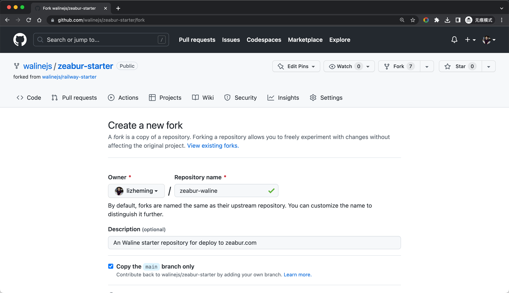
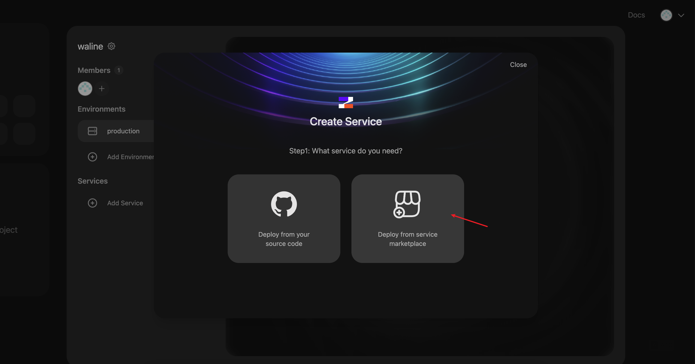
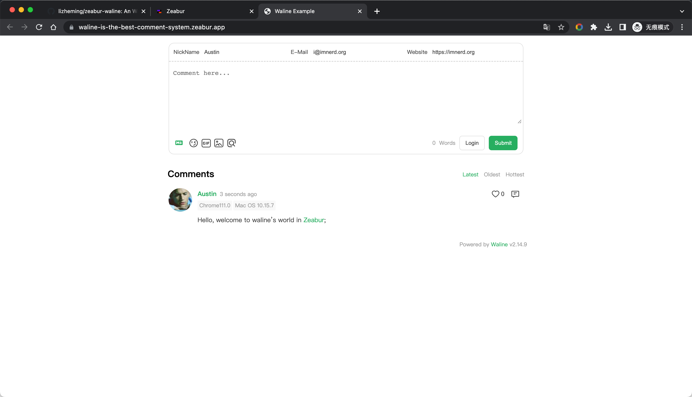
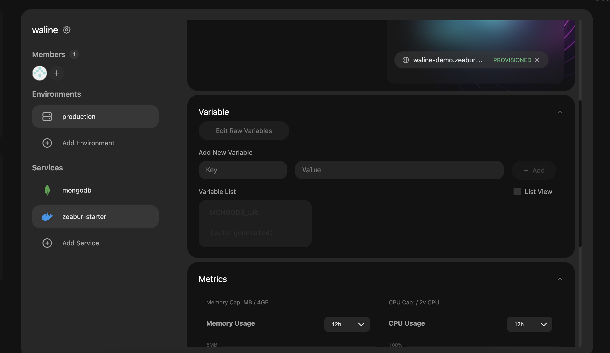

[Zeabur](https://zeabur.com) is a platform that helps developers deploy their own services with one click. The whole is similar to Railway, but it has more functions than it, no need to bind a credit card, and the free limit is higher than it.

<!-- more -->

## How to deploy

Click the [Fork](https://github.com/walinejs/zeabur-starter/fork) button to create a Zeabur starter scaffold.

https://dash.zeabur.com Log in to the Zeabur console. If there is no project, you need to set a name for the new project first.

After entering, click <kbd>Add New Service</kbd> to create a service, select <kbd>Deploy Other Service</kbd> - <kbd>Deploy MongoDB</kbd> to create a database service first.

Give our MongoDB database service a name, click the <kbd>Deploy</kbd> button, and our database service is deployed.

|  |  |
| ---------------------------------------- | ---------------------------------------- |

Next, we continue to click <kbd>Add New Service</kbd> to create the Waline service, this time we choose to click <kbd>Deploy Your Source Code</kbd>. In the following GitHub project list, find the project that we forked at the beginning, and click the corresponding <kbd>Import</kbd> button.

Give our Waline service a name, click the <kbd>Deploy</kbd> button, and our Waline service is deployed.

|  |  |
| ---------------------------------------- | ---------------------------------------- |

Don't rush to close the Waline service panel. After the service is deployed, we need to add an access domain name to the service. Click the <kbd>Generate Domain</kbd> button under the <kbd>Domains</kbd> tab, enter the domain name prefix you want and click the <kbd>Save</kbd> button to add it to our service Visit the domain name.

|  |  |
| ---------------------------------------- | ---------------------------------------- |

Everything is ready, and the next step is to witness the miracle. Open the access domain name we just set up, test to post comments, everything is successful~ Next, configure this domain name in the client and you can comment happily!

## How to update

Go to the GitHub repository and modify the `@waline/vercel` version number in the package.json file to the latest version.

## How to modify environment variables

You can enter the environment variable management page through <kbd>Variables</kbd> Tab, and it will be automatically redeployed after modification.

